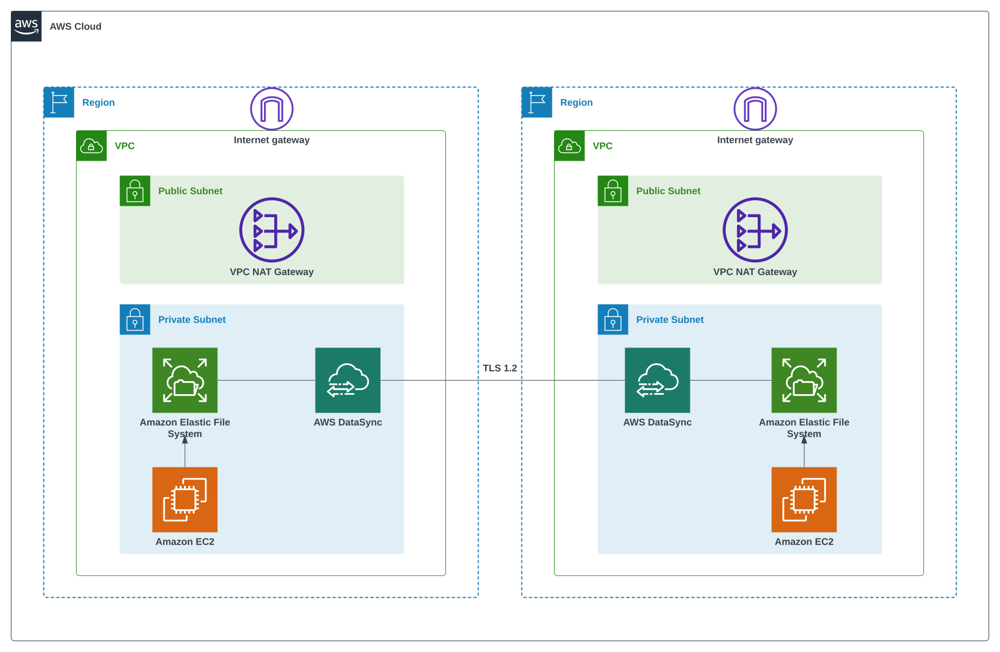

# EFS Cross-Region DataSync Project

## Introduction
This project contains the AWS Cloud Development Kit (CDK) code for deploying AWS DataSync along with its dependent resources. It's designed to facilitate efficient and secure data transfer between Amazon Elastic File System (EFS) instances across different regions.

## Architecture Diagram

## CDK Constructs
### datasync-location.ts
This construct creates the AWS DataSync Location resources. These locations define the source (EFS file system in the primary region) and destination (EFS file system in the secondary region) for the data transfer.

### datasync-task.ts
This construct creates the AWS DataSync Task resource. The task is responsible for transferring data between the source and destination locations. It includes configurations for scheduling, error handling, and data validation.

## CDK Stacks
### datasync-stack.ts
This stack deploys the AWS DataSync resources necessary for the synchronization of data between EFS file systems. It includes configurations for data transfer tasks, scheduling, and monitoring.

### ec2-stack.ts
This stack provisions EC2 instances that are used for various operational purposes within the project, such as hosting applications or services that interact with the EFS file systems.

### efs-stack.ts
The EFS Stack is responsible for creating and configuring the Elastic File System resources. It ensures that the file systems are correctly set up to work with DataSync for cross-region synchronization.

### vpc-stack.ts
This stack creates a Virtual Private Cloud (VPC) environment, setting up the network infrastructure required for secure communication between the different AWS services used in this project.

## Deployment Instructions
1. **Install Node.js**: Ensure that Node.js is installed on your system. You can download it from [Node.js official website](https://nodejs.org/).

2. **Install AWS CLI**: Ensure AWS CLI is installed and configured with the appropriate credentials. Instructions can be found on the [AWS CLI documentation](https://aws.amazon.com/cli/).

3. **Clone the Repository**: Clone or download this project repository to your local machine.

4. **Install Node Dependencies**:
    - Navigate to the root directory of this project.
    - Run `npm ci` to install the required node modules.

5. **Install AWS CDK Toolkit**: If you haven't already installed the AWS CDK Toolkit, run `npm install -g aws-cdk`.

6. **CDK Bootstrap**:
    - Bootstrap your AWS environment in each desired region. Run `cdk bootstrap aws://ACCOUNT_ID/REGION` for each region where you want to deploy the stacks.

7. **List Stacks**: Before deploying, you can see a list of all the deployable stacks in this project by running `cdk list`.

8. **Deploy Stacks**:
    - Run `cdk deploy --all --require-approval never` to deploy all the stacks to your AWS account without requiring manual approval for any changes.